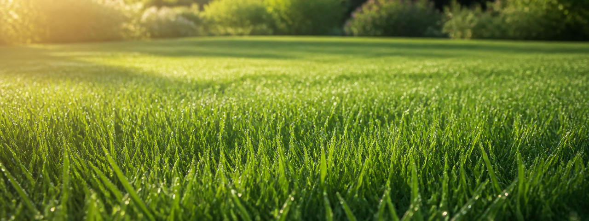

# Lawn Control



Lawn Control is a Home Assistant custom integration that gives lawn care advice from a weather entity, forecast data and optional real sensors for rain, temperature, humidity and soil moisture.

## Entities

- `sensor.lawn_recommended_grass_height`: target grass height in millimeters with `min_height`, `max_height` and `reason` attributes.
- `sensor.lawn_drought_risk`: `low`, `medium`, `high` or `critical`, with score details.
- `sensor.lawn_growth_rate`: `stopped`, `slow`, `normal` or `fast`, with estimated millimeters per day and next 7 days.
- `sensor.lawn_fertilizer_score`: numeric score from 0 to 100 with scoring details.
- `binary_sensor.lawn_good_day_for_fertilizer`: on when score and blocking checks allow fertilizing.
- `binary_sensor.lawn_should_mow`: on when mowing is recommended.
- `binary_sensor.lawn_robot_mower_should_run`: on when a configured robot mower should be allowed to run.
- `sensor.lawn_care_recommendation`: short human-readable action summary.

## Configuration

Add the integration from Home Assistant's integrations UI. The config flow asks for:

- Weather entity
- Optional temperature, rain, humidity and soil moisture sensors
- Lawn type
- Robotic mower presence
- Daily assessment hour from 0 to 23
- Shade level
- Soil type
- Care level
- Minimum and maximum grass height
- Whether you water during dry periods, and the watering level
- Optional NPK fertilizer percentages and latest fertilizer date in `YYYY-MM-DD` format, for example `2026-05-20`

## Rule Approach

The rule engine is intentionally simple in `0.2.1`. It uses transparent scoring and blocking checks for:

- Higher grass during summer stress, shade and wear.
- Drought risk from rain, forecast rain, temperature, humidity, soil moisture, soil type and season.
- Watering during dry periods reduces drought stress and can support growth after dry weather.
- Growth rate from season, temperature and drought stress.
- Extra expected growth from recent NPK fertilizer, mainly driven by nitrogen and reduced over time.
- Fertilizer age is calculated automatically from the latest fertilizer date on every update.
- Fertilizer suitability from season, growth, drought stress, heat and rain forecast.
- Mowing suitability from wet conditions, drought risk, growth rate and forecast rain.
- Robot mower run permission from mowing suitability, recent weather history, wet grass, rain forecast, drought stress and growth.

Each advisory entity exposes the decision details in attributes so the result can be inspected and refined.

Recommended grass height is locked once per day from the configured daily assessment hour. Robot mower run permission is also locked once per day from that hour, using recent temperature, humidity and rain history together with forecast and current lawn factors.

## HACS

This repository is structured for HACS as a Home Assistant integration. Add it as a custom repository in HACS, then install and restart Home Assistant.

## Languages

The integration includes English and Danish translations for the config flow, options flow, select options and entity names.

## Development

Run a syntax check:

```bash
python -m compileall custom_components
```
