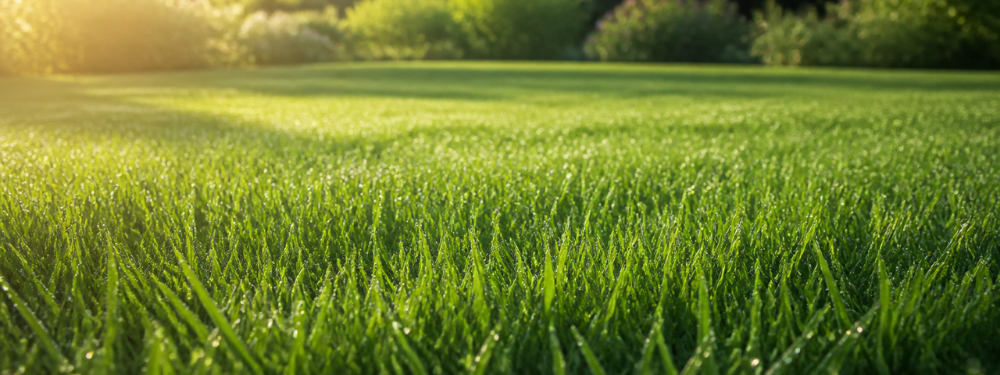

# Lawn Control



<p align="center">
  <a href="https://github.com/Ralleberg/lawn_control/releases">
    
  </a>
  <a href="https://github.com/Ralleberg/lawn_control/blob/main/LICENSE">
    
  </a>
  <a href="https://github.com/Ralleberg/lawn_control/releases">
    
  </a>
</p>

<p align="center">
  <a href="https://my.home-assistant.io/redirect/hacs_repository/?owner=Ralleberg&repository=lawn_control&category=integration">
    
  </a>
</p>

---

## Overview

**Lawn Control** is a Home Assistant custom integration that provides intelligent lawn care recommendations based on weather forecasts, historical weather data, and optional environmental sensors.

Instead of controlling hardware directly, Lawn Control continuously analyzes lawn conditions and exposes entities that can be used in Home Assistant dashboards, automations, and notifications.

Version `1.2.3` is advisory only. It exposes a robot mower permission entity,
but it does not send commands to mower hardware.

Every recommendation includes detailed attributes explaining exactly why the recommendation was made.

### Features

- 🌱 Recommended grass height
- 🌧️ Drought risk assessment
- 📈 Estimated grass growth
- 🧪 Fertilizer effectiveness tracking
- 🤖 Robot mower permission
- ✂️ Hourly mowing recommendation
- 🍂 Scarifying recommendation
- 💧 Historical, forecast and combined rainfall analysis
- ⚙️ Fully configurable rule engine
- 🌍 English and Danish translations

> [!NOTE]
> Lawn Control is an **advisory integration**.
> It never controls robot mowers or irrigation systems directly.
> Instead it exposes entities that you can use in your own Home Assistant automations.

---

# Installation

## HACS (Recommended)

Click below to add the repository directly to HACS.

<p align="center">
  <a href="https://my.home-assistant.io/redirect/hacs_repository/?owner=Ralleberg&repository=lawn_control&category=integration">
    
  </a>
</p>

After adding the repository:

1. Open **HACS**
2. Install **Lawn Control**
3. Restart Home Assistant
4. Navigate to **Settings → Devices & Services**
5. Add the **Lawn Control** integration

---

# Configuration

The setup wizard guides you through configuring the integration.

## Required

- Weather entity

## Optional sensors

- Rain sensor
- Temperature sensor
- Humidity sensor
- Soil moisture sensor

## Lawn settings

- Lawn type
- Soil type
- Shade level
- Care level
- Minimum grass height
- Maximum grass height

## Watering

- Whether the lawn is watered during dry periods
- Watering level

## Robot mower

- Whether a robotic mower is present
- Whether mowing is allowed between sunset and sunrise

## Fertilizer

Optional fertilizer configuration:

- Nitrogen (N)
- Phosphorus (P)
- Potassium (K)
- Application date (`YYYY-MM-DD`)

Example:

```text
2026-05-20
```

---

# Entities

| Entity | Description |
|----------|-------------|
| `sensor.lawn_recommended_grass_height` | Recommended grass height with detailed decision attributes. |
| `sensor.lawn_drought_risk` | Current drought risk and score details. |
| `sensor.lawn_growth_rate` | Estimated grass growth including fertilizer and weather effects. |
| `sensor.lawn_fertilizer_score` | Remaining fertilizer effectiveness from 0–100. |
| `sensor.lawn_historical_rain` | Historical rainfall used by the rule engine. |
| `sensor.lawn_forecast_rain` | Forecast rainfall used by the rule engine. |
| `sensor.lawn_combined_rain` | Combined rainfall used for moisture calculations. |
| `sensor.lawn_care_recommendation` | Human-readable lawn care summary. |
| `binary_sensor.lawn_good_day_for_fertilizer` | Indicates whether fertilizing is recommended. |
| `binary_sensor.lawn_should_mow` | Hourly mowing recommendation. Not created when robotic mower support is enabled. |
| `binary_sensor.lawn_robot_mower_should_run` | Indicates whether a robot mower should be allowed to operate. |
| `binary_sensor.lawn_should_verticut` | Indicates whether scarifying is recommended. |

---

# How Lawn Control Works

The rule engine combines weather data, optional sensors and configurable lawn settings to generate recommendations.

The calculations consider:

- Historical rainfall
- Forecast rainfall
- Temperature
- Humidity
- Soil moisture
- Soil type
- Lawn type
- Shade level
- Watering habits
- Season
- Fertilizer age
- Fertilizer composition
- Current growth conditions

Every advisory entity exposes detailed attributes so the reasoning behind every recommendation can be inspected.

Recommended grass height, mowing recommendations and the other advisory sensors update hourly, and source entity changes can trigger immediate refreshes.

If the required weather entity is unavailable, all Lawn Control entities become unavailable. Configured optional sensors can be unavailable without stopping the rule engine; affected source entities are listed in each entity's attributes.

---

# Recommendation Logic

## Grass Height

Recommended grass height is adjusted according to available moisture and seasonal growth.

## Drought Risk

Calculated using:

- Rain history
- Rain forecast
- Temperature
- Humidity
- Soil moisture
- Soil type
- Watering
- Season

## Growth Rate

Growth depends on:

- Season
- Temperature
- Moisture
- Drought stress
- Fertilizer effect

## Fertilizer

The fertilizer model estimates the remaining fertilizer effect using:

- Fertilizer age
- NPK composition
- Nitrogen strength
- Moisture availability

## Mowing

Mowing recommendations consider:

- Wet grass
- Forecast rainfall
- Drought stress
- Current growth
- Recent weather

The mowing recommendation is evaluated on each hourly coordinator update instead of being locked for a fixed daily period.

## Robot Mower

The robot mower permission sensor evaluates:

- Current mowing suitability
- Wet conditions
- Forecast rainfall
- Drought stress
- Optional night mowing restrictions

## Scarifying

Scarifying recommendations are based on:

- Season
- Moisture
- Growth
- Drought stress
- Current lawn conditions

---

# Automation Examples

Lawn Control is intended to work together with Home Assistant automations.

Typical examples include:

- Pause a robot mower when mowing is not recommended.
- Notify when fertilizing conditions are ideal.
- Trigger irrigation when drought risk becomes critical.
- Display lawn recommendations on dashboards.
- Schedule mowing only on suitable days.

---

# Languages

The integration currently includes:

- 🇬🇧 English
- 🇩🇰 Danish

Additional translations are welcome through pull requests.

---

# Development

Verify the integration syntax:

```bash
python -m compileall custom_components
```

---

# Contributing

Contributions are always welcome.

If you discover a bug, have ideas for improvements, or would like to enhance the rule engine, please open an issue or submit a pull request.

---

# License

This project is released under the MIT License.
